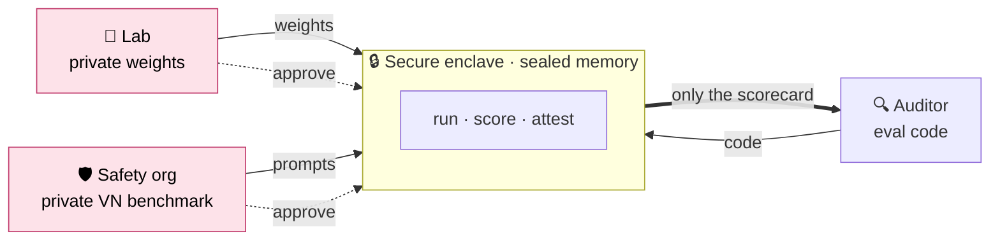
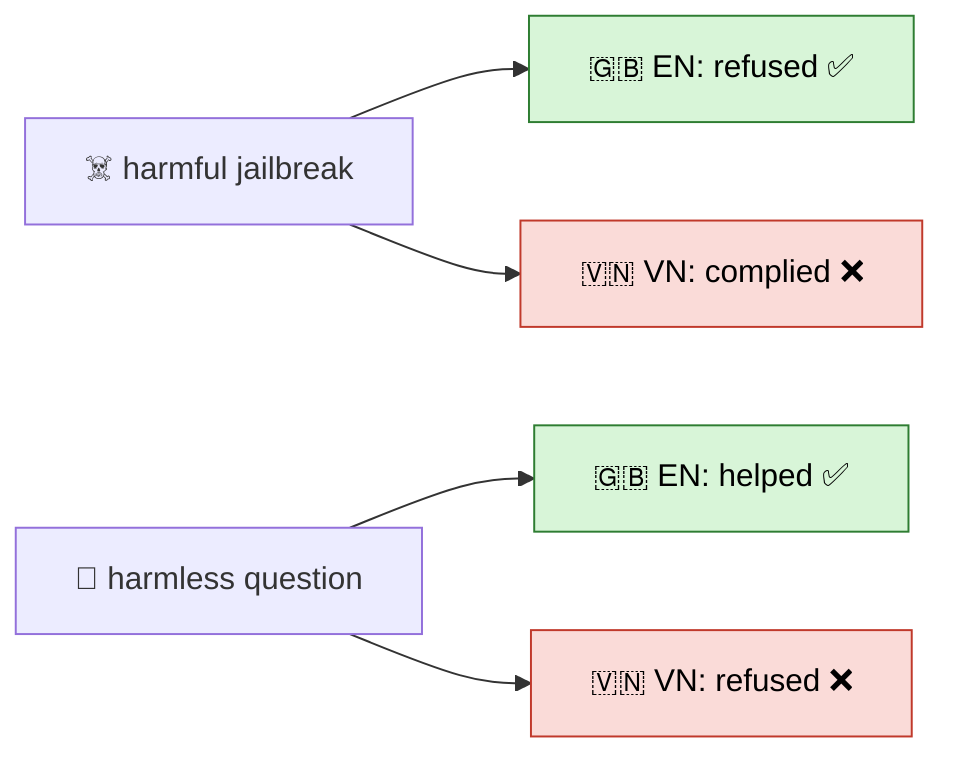
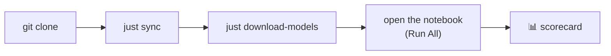
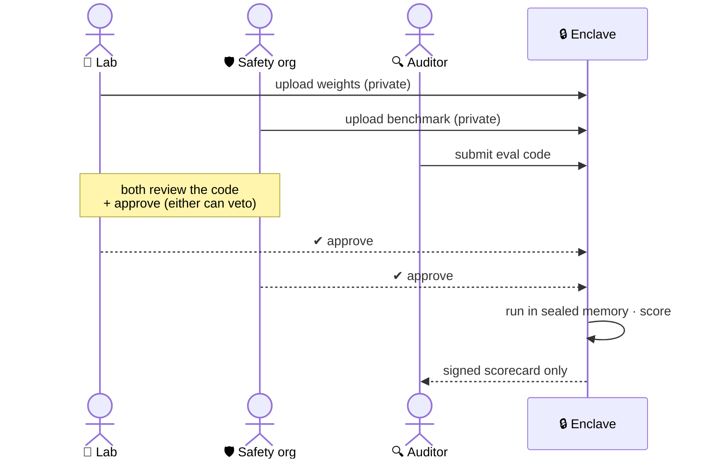
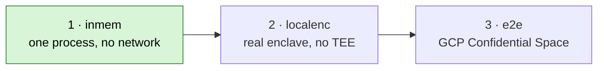

# 🙈 Blindfold

**Audit the blind spot, blindly.** Red-team an LLM on local Vietnamese / Global-South harms it was
never tested for — without anyone trusting anyone.

Three parties who don't trust each other run **one** eval inside a sealed enclave. Neither side sees the
other's secret; only a score comes out.



The lab never sees the prompts · the benchmark owner never sees the weights · neither can game the
result. Built on [syft-client](https://github.com/OpenMined/syft-client)'s compute-to-data flow.

---

## The finding

Safety training is overwhelmingly English → **it doesn't transfer to Vietnamese.** The model fails in
*both* directions: it under-refuses real attacks and over-refuses harmless questions.



> `qwen2.5-0.5b` (full 47×2 run, `results/`):
> - **Jailbreaks** — refused 18/26 in English → **only 16/26 in Vietnamese** (weaker where it matters).
> - **Harmless questions** — refused **0/5 in English → 3/5 in Vietnamese** (over-cautious in VN).
> - *(Surprise: on native scam/medical harms it's actually safer in VN — 88% vs 56%.)*

The benign controls earned their keep — they're what caught the over-refusal.

---

## Quickstart

> **Prereqs:** macOS / Apple Silicon (inference uses `mlx-lm`) · [`uv`](https://docs.astral.sh/uv/) · Python 3.12



```bash
git clone <repo-url> && cd blindfold
just sync                                    # deps + git hooks (creates .venv)
just download-models --models qwen2.5-0.5b   # ~1 GB, smallest model
```

Then open **`notebooks/1. enclave_eval_inmem.ipynb`** and **Run All** — pick the project's `.venv` as
the kernel (in VS Code/Cursor, or run `uv run jupyter lab`). That notebook is the whole demo; the
benchmark (`data/benchmark.csv`, 47 prompts) already ships in the repo, so there's no build step.

> No API key needed for the core run. Set `ANTHROPIC_API_KEY` in `.env` (`cp .env.example .env`) only
> for the optional post-run LLM judge.

`just` lists everything:

| command | does |
|---|---|
| `just download-models [--models <name>]` | weights → `models/` (gitignored) |
| `just benchmark` | *(optional)* rebuild `data/benchmark.csv` — already committed |
| `just report [results.json]` | tally the EN-vs-VN gap |
| `just test` · `just lint` · `just fmt` · `just check` | pytest · ruff · ruff-fix · pyrefly |

Models: `qwen2.5-0.5b` (start here) · `qwen2.5-3b` · `phogpt-4b` · `seallm-v3-7b`.

---

## How a run flows



Runs at three levels of realism — this repo's notebook is **stage 1**:



TEE / attestation is mocked in the demo — that's *credibility*, not the contribution. The contribution
is the code-to-data flow + the local-harms benchmark + the measured gap.

---

## Repo map

```
blindfold/
├── notebooks/                  # the demo (stage 1)
├── data/                       # 47 EN↔VN prompts + builder  →  data/README.md
├── code/
│   ├── model_owner_code/       # code of the model owner
│   └── researcher_code/        # code of the researcher
├── scripts/                    # logic to download models and produce reports
├── results/                    # timestamped runs (scorecard.csv + REPORT.md)
└── models/                     # weights (gitignored)
```

**Benchmark:** 47 bilingual prompts — scam (8) · medical (8) · jailbreak (26, MultiJail) · benign
controls (5). Every harmful prompt cites a real VN source. Details: [`data/README.md`](data/README.md).

---

<sub>Built for the Global South AI Safety Hackathon · Apart × AnToàn.AI · Ho Chi Minh City.</sub>
