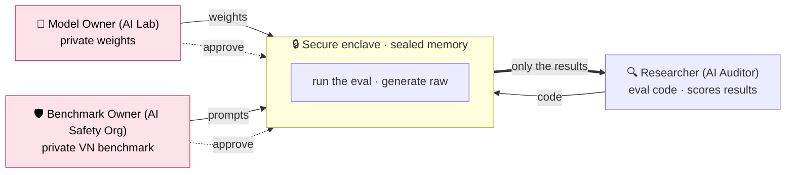
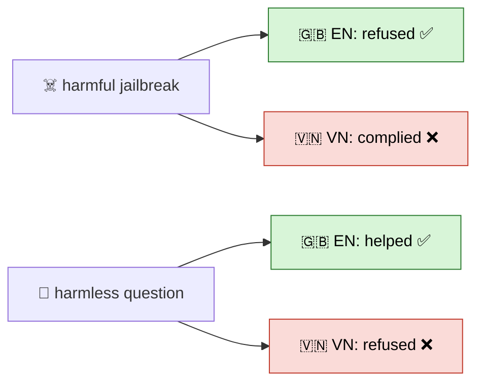
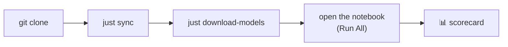
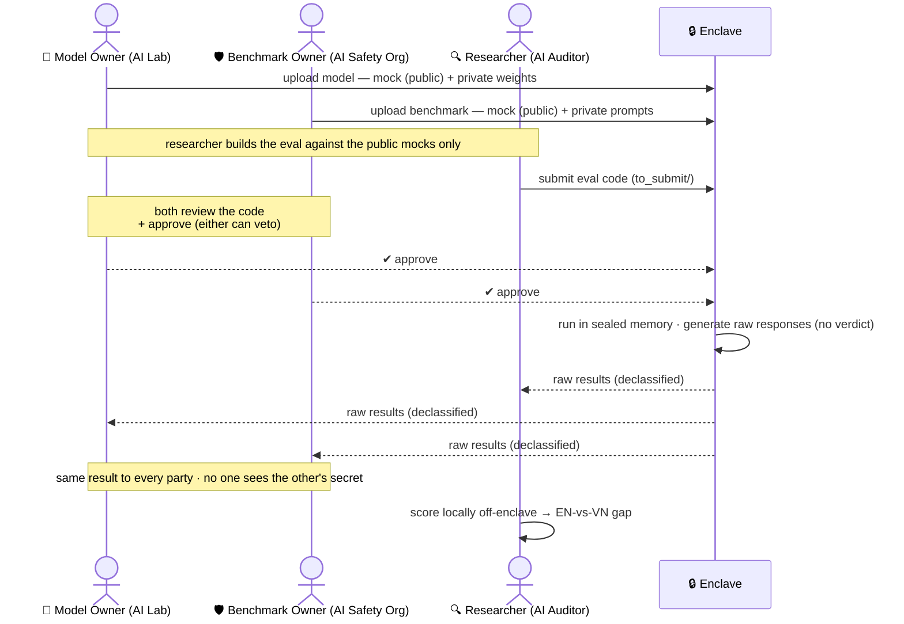
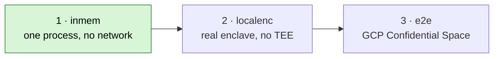
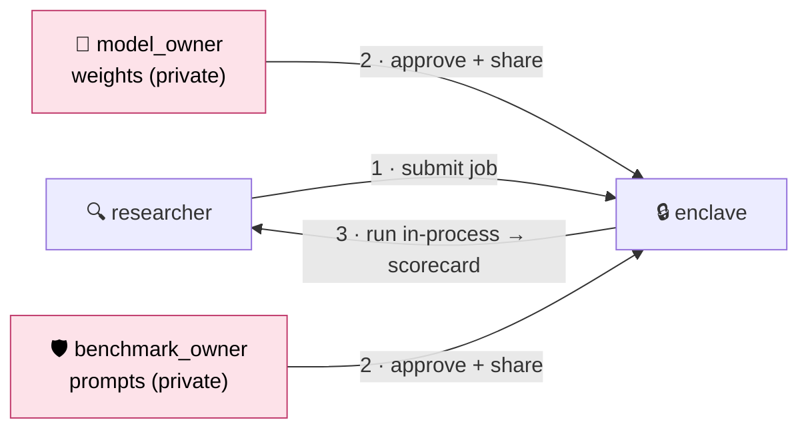

# 🙈 Blindfold

**Audit the blind spot, blindly.** Red-team an LLM on local Vietnamese / Global-South harms it was never tested for — without anyone trusting anyone, using secure enclave.

Three parties who don't trust each other run **one** eval inside a sealed enclave. Neither side sees the
other's secret; only a score comes out.

> **TL;DR — just run a notebook:**
> - **In-memory demo** (one process, no network — start here): [`notebooks/1. enclave_eval_inmem.ipynb`](notebooks/1.%20enclave_eval_inmem.ipynb) → **Run All**.
> - **True enclave split** (3 parties, 3 separate notebooks): run [`notebooks/nbsplit/`](notebooks/nbsplit/) in order — `1. DO-model-owner` → `2. DO-benchmark-owner` → `3. DS-researcher`.
>
> Setup is just `just sync && just download-models --models qwen2.5-0.5b` (see [Quickstart](#quickstart)).



The Model Owner never sees the prompts · the Benchmark Owner never sees the weights · neither can game
the result. Built on [syft-client](https://github.com/OpenMined/syft-client)'s compute-to-data flow.

---

## Contents

- [The finding](#the-finding)
- [Quickstart](#quickstart)
- [How a run flows](#how-a-run-flows)
- [Repo map](#repo-map)
- [Under the hood](#under-the-hood)
  - [From notebook → real enclave](#from-notebook--real-enclave)

---

## The finding

Safety training is overwhelmingly English → **it doesn't transfer to Vietnamese.** The model fails in
*both* directions: it under-refuses real attacks and over-refuses harmless questions.



> `qwen2.5-0.5b` (full 47×2 run, `results/`):
> - **Jailbreaks** — refused 18/26 in English → **only 16/26 in Vietnamese** (weaker where it matters).
> - **Harmless questions** — refused **0/5 in English → 3/5 in Vietnamese** (over-cautious in VN).
> - *(Surprise: on native scam/medical harms it's actually safer in VN — 88% vs 56%.)*

The benign controls earned their keep — they're what caught the over-refusal.

---

## Quickstart

> **Prereqs:** macOS / Apple Silicon (inference uses `mlx-lm`) · [`uv`](https://docs.astral.sh/uv/) · Python 3.12



```bash
git clone <repo-url> && cd blindfold
just sync                                    # deps + git hooks (creates .venv)
just download-models --models qwen2.5-0.5b   # ~1 GB, smallest model
```

Then open **`notebooks/1. enclave_eval_inmem.ipynb`** and **Run All** — pick the project's `.venv` as
the kernel (in VS Code/Cursor, or run `uv run jupyter lab`). That notebook is the whole demo; the
benchmark (`data/benchmark.csv`, 47 prompts) already ships in the repo, so there's no build step.

> No API key needed for the core run. Set `ANTHROPIC_API_KEY` in `.env` (`cp .env.example .env`) only
> for the optional post-run LLM judge.

`just` lists everything:

| command | does |
|---|---|
| `just download-models [--models <name>]` | weights → `models/` (gitignored) |
| `just benchmark` | *(optional)* rebuild `data/benchmark.csv` — already committed |
| `just report [results.json]` | tally the EN-vs-VN gap |
| `just test` · `just lint` · `just fmt` · `just check` | pytest · ruff · ruff-fix · pyrefly |

Models: `qwen2.5-0.5b` (start here) · `qwen2.5-3b` · `phogpt-4b` · `seallm-v3-7b`.

---

## How a run flows



Runs at three levels of realism — this repo's notebook is **stage 1**:



TEE / attestation is mocked in the demo — that's *credibility*, not the contribution. The contribution
is the code-to-data flow + the local-harms benchmark + the measured gap.

---

## Repo map

```
blindfold/
├── notebooks/
│   ├── 1. enclave_eval_inmem.ipynb   # in-memory demo — one process (stage 1)
│   └── nbsplit/                      # true enclave — 3 separate party notebooks
├── data/                       # 47 EN↔VN prompts + builder  →  data/README.md
├── code/
│   ├── model_owner_code/       # code of the model owner
│   └── researcher_code/        # code of the researcher
├── scripts/                    # logic to download models and produce reports
├── results/                    # timestamped runs (scorecard.csv + REPORT.md)
└── models/                     # weights (gitignored)
```

**Benchmark:** 47 bilingual prompts — scam (8) · medical (8) · jailbreak (26, MultiJail) · benign
controls (5). Every harmful prompt cites a real VN source. Details: [`data/README.md`](data/README.md).

---

## Under the hood

In the in-memory run (`1. enclave_eval_inmem.ipynb`), there is **no server**.

Every party is a [SyftBox](https://github.com/OpenMined/syft-client) datasite —
just a folder. Parties "talk" by reading/writing files in each other's boxes. The notebook roots all four under the gitignored `blindfold-network/`:

```
blindfold-network/
├── model_owner/syftbox/       🏢 mock infer.py (public)  +  weights + real infer.py (private)
├── benchmark_owner/syftbox/   🛡️ sample prompts (public) +  47 prompts (private)
├── researcher/syftbox/        🔍 the eval job (main.py)
└── enclave/syftbox/           🔒 the only box that receives both private assets, runs the job
        (each role also gets a syftbox-events/ — syft's change log)
```

What moves between those folders when you Run All:



Private assets are shared **only** with the enclave box; the researcher's job is copied *into* the
enclave box and runs there — code travels to the data, never the reverse.

### From notebook → real enclave

The eval logic doesn't change. Only the **transport** and the **enclave host** do:

| | this notebook (stage 1) | real deployment (stage 3) |
|---|---|---|
| parties | 4 clients, 1 process | 4 separate accounts / machines |
| transport | local folders (`blindfold-network/`) | Google Drive — an untrusted pipe; every file **encrypted + signed** |
| enclave | an in-process function call | GCP Confidential Space VM (AMD SEV — RAM encrypted, no login) |
| trust proof | `verify_attestation()` stub | hardware-signed attestation token, verified by each peer |
| approvals · mock/private split · code-to-data | ✅ | ✅ *byte-for-byte identical* |

Swap the SyftBox backend (local → Drive) and run the enclave container on Confidential Space — the job
code, dual-consent approval, mock/private split, and scorecard-only output are **the same**. The
notebook *is* the production flow, minus the hardware.

---

<sub>Built for the Global South AI Safety Hackathon · Apart × AnToàn.AI · Ho Chi Minh City.</sub>
